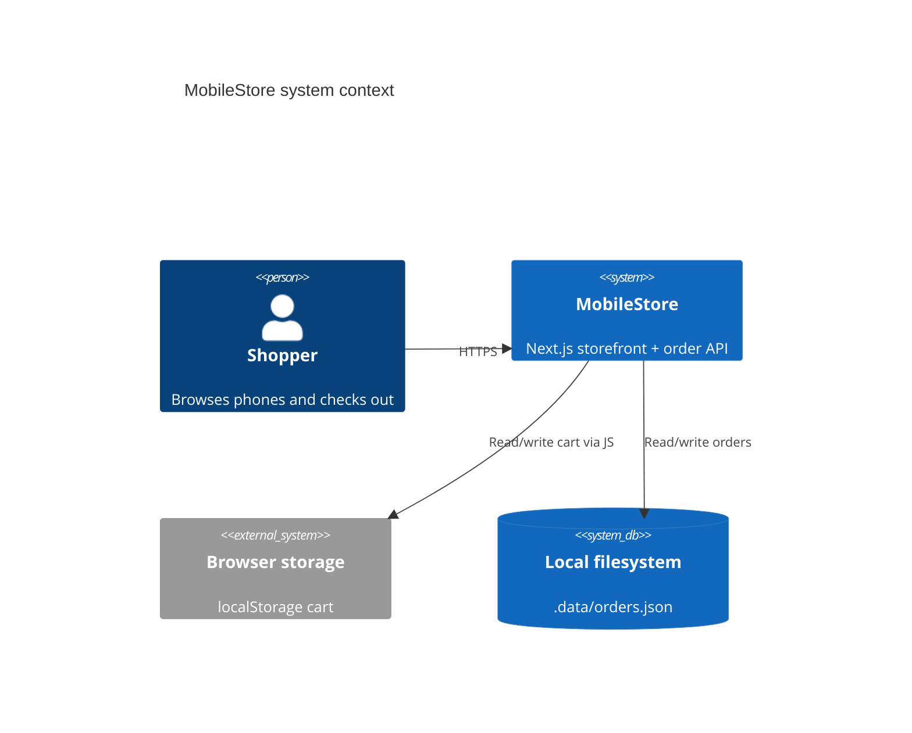
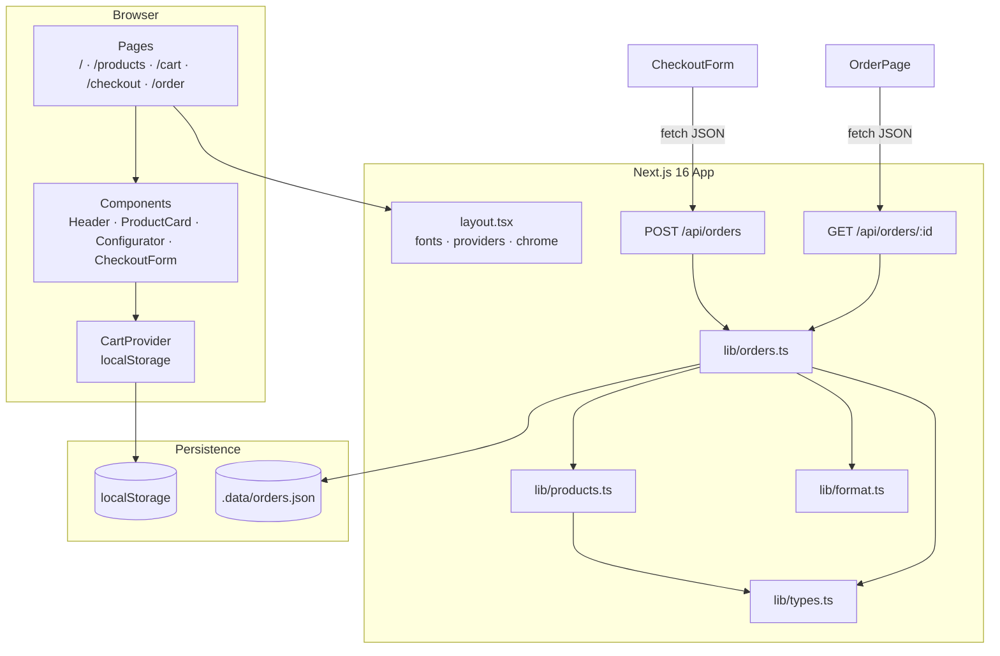
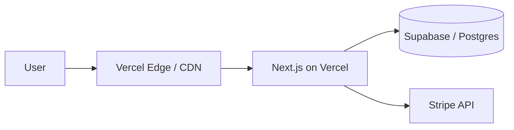

# System Architecture

## 1. Context (C4-style)



> If the C4 renderer is unavailable, use the component diagram below.

## 2. Container / component view



## 3. Layering

| Layer | Responsibility | Location |
|-------|----------------|----------|
| Presentation | Routes, layout, CSS | `src/app/**`, `globals.css` |
| UI components | Reusable interactive pieces | `src/components/**` |
| Domain / lib | Catalog, pricing, validation, order write | `src/lib/**` |
| Transport | HTTP handlers | `src/app/api/**` |
| Persistence | Cart + orders | localStorage + `.data/` |

## 4. Runtime topology

```
Developer machine / single Node process
└── next dev | next start
    ├── Static / SSG pages (home, PDPs via generateStaticParams)
    ├── Client islands ("use client" cart, checkout, order)
    └── Route handlers (orders API) → filesystem
```

**Not** a multi-service architecture. One deployable unit.

## 5. Deployment shape (recommended later)



Current MVP stops at **App + local JSON**.

## 6. Cross-cutting concerns

| Concern | Approach today |
|---------|----------------|
| Styling | Design tokens in `globals.css` + component class names |
| Icons | `lucide-react` |
| Fonts | `next/font` — Figtree + Bricolage Grotesque |
| Errors | Field map from API → CheckoutForm; empty/404 states on pages |
| Typing | Shared types in `src/lib/types.ts` |
