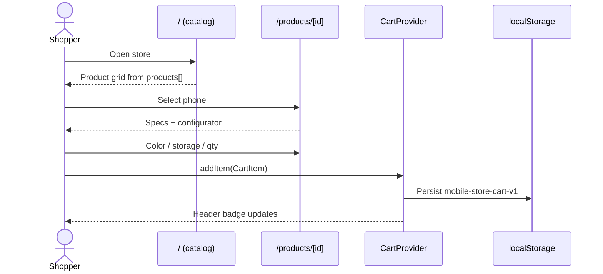
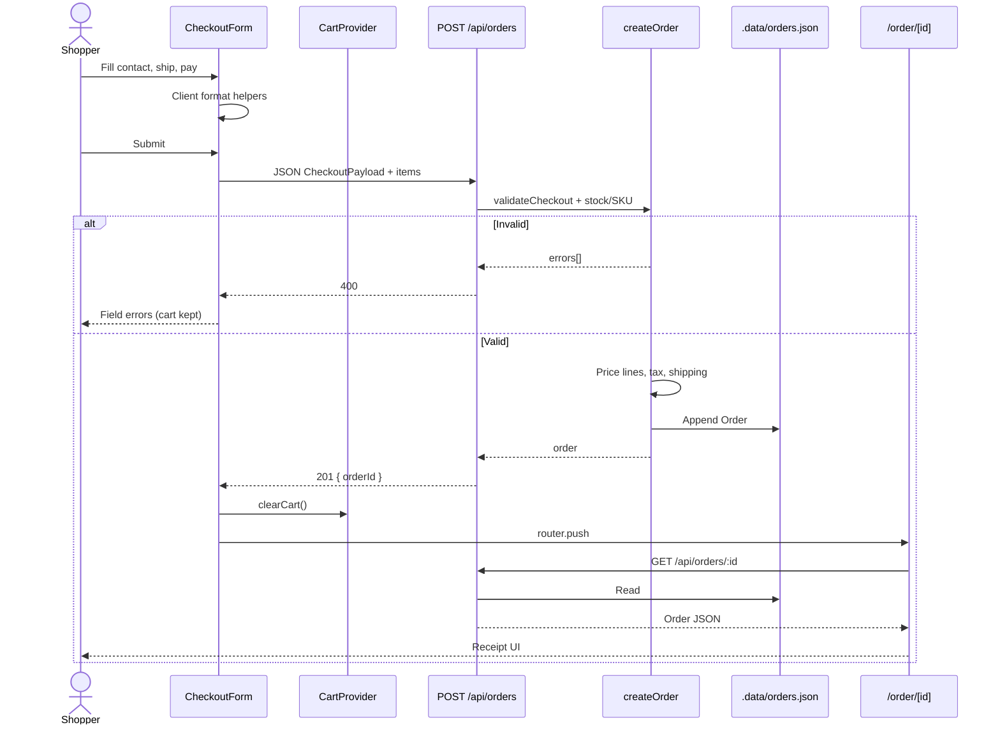
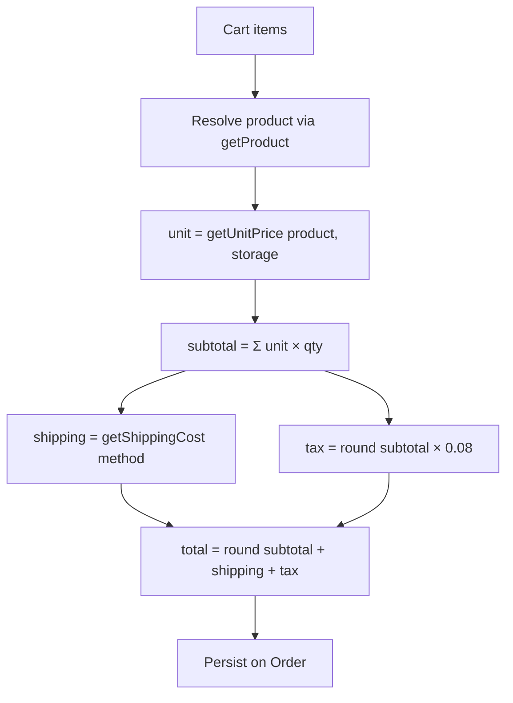
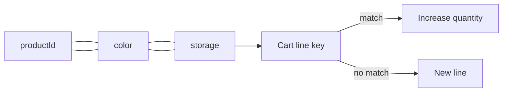
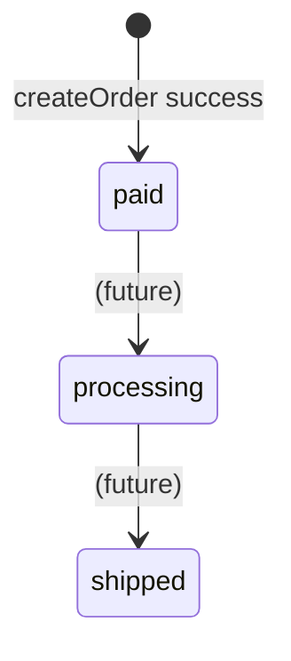

# Data Flow

## 1. Browse → configure → cart

## 2. Checkout → order → confirmation

## 3. Money calculation pipeline

**Important:** Client summary is UX only. **Authoritative totals** are computed in `src/lib/orders.ts` at create time.

## 4. Cart line identity

## 5. Persistence boundaries

| Data | Written by | Read by | Lifetime |
|------|------------|---------|----------|
| Catalog | Developer (git) | Server + client imports | Until deploy |
| Cart | Browser | Browser | Until clear / successful checkout |
| Order | Server API | Server API → confirmation page | Until `.data` deleted |

## 6. State machine — order

MVP only creates **`paid`**. Other statuses exist on the type for forward compatibility.
