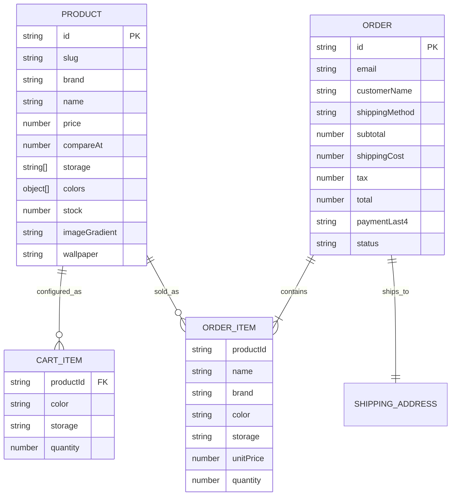

# Domain Model

## 1. Entity relationship (logical)

## 2. TypeScript ownership

Canonical types live in **`src/lib/types.ts`**:

- `Product`
- `CartItem`
- `CheckoutPayload`
- `Order` / `OrderItem`
- `ShippingMethod`

Do not duplicate shapes in components — import from `@/lib/types`.

## 3. Pricing rules

Storage premiums (`src/lib/products.ts`):

| Storage | Absolute premium |
|---------|------------------|
| 64GB / 128GB | $0 |
| 256GB | $100 |
| 512GB | $300 |
| 1TB | $500 |

**Unit price** = `product.price + premium(selected) − premium(product.storage[0])`.

Example — iPhone 17 Pro Max base 256GB @ $1199:

| Storage | Price |
|---------|-------|
| 256GB | $1199 |
| 512GB | $1399 |
| 1TB | $1599 |

## 4. Shipping & tax

| Method | Cost |
|--------|------|
| standard | $0.00 |
| express | $14.99 |
| overnight | $29.99 |

Tax = **8%** of merchandise subtotal only (`calcTax` in `format.ts`).

## 5. Catalog (current)

Maintained in `src/lib/products.ts`. Includes Apple **iPhone 17 Pro Max** (256 / 512 / 1TB) plus demo brands (ATLAS, NOVA, PULSE, ORBIT, ZENITH).

Adding a product = append a `Product` object; ensure unique `id` / `slug`; first `storage` entry is the base price tier; set `wallpaper` (`ember` | `ocean` | `mint` | `titanium` | `neon` | `sunset` | `noir`) and a stage `imageGradient`.

## 6. Storefront visuals

| Piece | Owner |
|-------|--------|
| Phone mock + lock-screen wallpaper | `PhoneVisual` in `src/components/ProductCard.tsx` + wallpaper CSS in `globals.css` |
| Stage backdrop | `product.imageGradient` + `.phone-stage-*` |
| Cart thumbnail | `PhoneVisual` with `size="sm"` |
| Brand mark | `src/components/BrandLogo.tsx` |
| Payment brand row | `src/components/PaymentBrands.tsx` (stylized Visa / MC / Amex / Apple Pay / GPay / Discover) |
