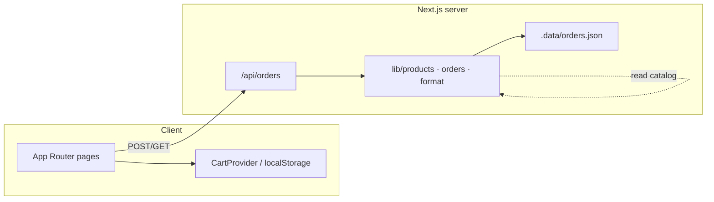

# System Design

## 1. Summary

MobileStore is a **single Next.js application** that serves the storefront UI and a small order API. Catalog is **code-owned** (TypeScript module). Cart is **client-owned** (localStorage). Orders are **server-owned** (JSON file on disk).

## 2. Design principles

1. **Simplicity over platform** — no commerce SaaS for MVP.
2. **Server is source of truth for money** — prices, tax, shipping, and validation run in `createOrder`, not only on the client.
3. **Client is source of truth for cart intent** — until checkout succeeds.
4. **Catalog as code** — products versioned in git; easy for agents to edit.
5. **Demo-safe payments** — Luhn + format checks only; never log full PAN; store `paymentLast4` only.

## 3. Constraints

| Constraint | Implication |
|------------|-------------|
| No database | Orders are append-only JSON; not multi-region safe |
| No auth | Anyone who knows an order id can GET it (treat as soft secret) |
| Sync `fs` in API routes | Fine for local/demo; replace before horizontal scale |
| ZIP validator is US-style | International checkout needs rule change |
| Next.js 16 | Read `node_modules/next/dist/docs/` — APIs may differ from older Next |

## 4. Key decisions (ADRs)

### ADR-001: File-backed orders

- **Decision:** Persist orders in `.data/orders.json`.
- **Why:** Zero infra for MVP; inspectable; gitignored.
- **Consequence:** Lost on ephemeral hosts unless volume mounted; race conditions under concurrent writes.

### ADR-002: localStorage cart

- **Decision:** Persist cart client-side.
- **Why:** No session backend required.
- **Consequence:** Not shared across devices; cleared after successful order.

### ADR-003: Relative storage pricing

- **Decision:** `getUnitPrice` = base price + (premium[selected] − premium[first storage tier]).
- **Why:** Products can start at 128GB or 256GB without wrong upcharges.
- **Consequence:** Premiums live in `STORAGE_PREMIUM` map in `products.ts`.

### ADR-004: Demo card validation

- **Decision:** Luhn + expiry + CVC; no gateway.
- **Why:** Proves checkout UX and validation path.
- **Consequence:** Not legal tender processing; must swap for Stripe (or similar) before real sales.

## 5. Security notes (current MVP)

- Do **not** commit `.data/` or real card data.
- Order IDs are unguessable-ish (`MS-` + 8 hex) but not authorization.
- Prefer HTTPS in any deployed environment.
- Before production: auth, rate limits, real payments, durable DB, secrets management.

## 6. Extensibility map

| Future need | Suggested change |
|-------------|------------------|
| Real payments | Stripe Checkout or Payment Intents; store paymentIntentId |
| Durable orders | Supabase `orders` + `order_items` tables |
| Catalog CMS | Move products to DB; keep TypeScript types |
| Multi-tenant | Auth + RLS; never expose raw GET by id alone |
| Analytics | Client events on add-to-cart / purchase |
